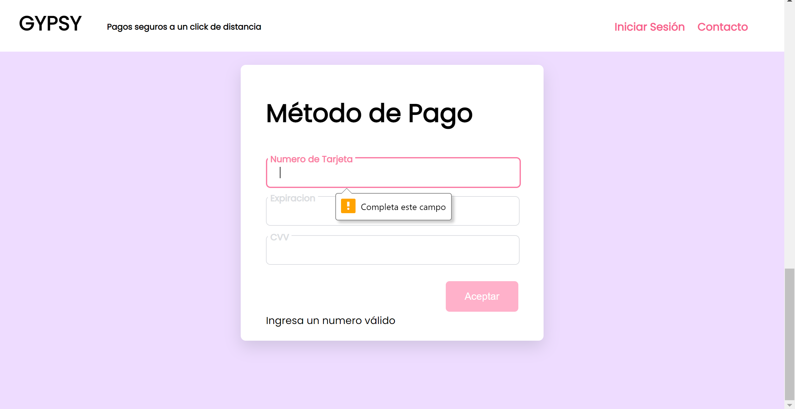

<h1 align="center"><b>Proyecto Validar Tarjeta de Crédito  
 Laboratoria</b></h1>
 
 

 
 

 
<h2 align="center">Autora  
Gabriela Gomez</h2>

## Índice

* [1. Acerca del Proyecto](#1-Acerca-del-proyecto)
* [2. Resumen del proyecto](#2-resumen-del-proyecto)
* [3. Proyecto]
* [4. Producto]
***

## Acerca del Proyecto

GYPSY es una plataforma diseñada para guardar tus datos bancarios y acceder a ellos en un sólo click. Por medio de un registro previo en un formulario en el que incluye tus datos personales (nombre completo, teléfono, email y dirección), GYPSY te ayuda a manejar tus tarjetas de manera segura para que realizar compras en línea deje de ser una preocupación y se convierta en algo tan fácil como dar un click y esperar tus compras en la puerta de tu casa.

Para realizar este proyecto se usaron conocimientos de Javascript, DOM y CSS.

## 2. Objetivos de aprendizaje generales

### HTML

- [x] **Uso de HTML semántico**

  

Links

### CSS

- [x] **Uso de selectores de CSS**

- [x]  **Modelo de caja (box model): borde, margen, padding**

### Web APIs

- [x] **Uso de selectores del DOM**

- [x] **Manejo de eventos del DOM (listeners, propagación, delegación)**

- [x] **Manipulación dinámica del DOM**

  
### JavaScript

- [x] **Tipos de datos primitivos**

- [x] **Strings (cadenas de caracteres)**

- [x] **Variables (declaración, asignación, ámbito)**

- [x] **Uso de condicionales (if-else, switch, operador ternario, lógica booleana)**

- [x] **Uso de bucles/ciclos (while, for, for..of)**

- [x] **Funciones (params, args, return)**

- [x] **Pruebas unitarias (unit tests)**

- [x] **Módulos de ECMAScript (ES Modules)**

- [x] **Uso de linter (ESLINT)**

- [x] **Uso de identificadores descriptivos (Nomenclatura y Semántica)**

  
### Control de Versiones (Git y GitHub)

- [x] **Git: Instalación y configuración**

- [x] **Git: Control de versiones con git (init, clone, add, commit, status, push, pull, remote)**

- [x] **GitHub: Creación de cuenta y repos, configuración de llaves SSH**

- [x] **GitHub: Despliegue con GitHub Pages**

 
  ### Diseño de producto

- [x] **Seguir los principios básicos de diseño visual**
  

## Proyecto
<h3> Hito 1 </h3>
  
La interfaz de tu aplicación debe:
  
  <li><b>Permitir insertar el número de la tarjeta que se quiere validar (texto) en un campo de texto vacío. </b></li>
  <li><b>Evitar que puedan escribir caracteres que no sean numéricos (dígitos 0-9).</b> </li>
  <li><b>Impedir que se intente validar si es que el campo está vacío (no se ha escrito nada).</b> </li>
  <li><b>Comunicar a la usuaria si se trata una tarjeta válida o no.</b> </li>
  <li><b>Ocultar todos los dígitos del número de tarjeta con exepción de los últimos 4 caracteres.</b> </li>
  </b> 
  </b>
  </b>  

  
   
  

<h3>
**2. Pruebas unitarias de los métodos.**  
Los metódos de `validator` (`isValid` y `maskify`) deben tener cobertura con
pruebas unitarias.
</b>

  

 </b> 
 </b>

4. Producto
<h3> Quiénes son los principales usuarios de producto </h3>

<li><b>Cualquiera que quiera hacer una compra en línea y no desee exponer sus datos bancarios a la página en la que quiere realizar su compra </b></li>
</b> 
</b>

<h3> Cuáles son los objetivos de estos usuarios en relación con tu producto</h3>

<li><b>Que sus datos bancarios se encuentren seguros mediante el respaldo de GYPSY</b></li>
<li><b>Hacer compras en línea de manera segura sin arriesgar sus datos bancarios</b></li>
<li><b>Evitar fraudes al asociar los datos bancarios a los datos personales y la verificación de dos pasos</b></li>

<h3> Cómo crees que el producto que estás creando está resolviendo sus problemas.</h3>

<li><b>La opcion de validar tarjeta permite saber si los datos ingresados son correctos para guardarlos y poder usarlos más adelante</b></li>
