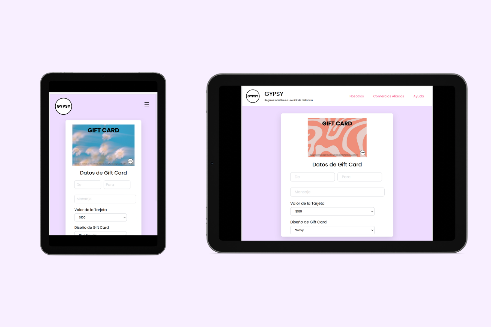

 

 
 

 
<h3 align="center">Autora  
  Gabriela Gomez </h3>
 

 
<a href="https://gabrielagl.github.io/GYPSY/src/) target="_blank"><strong>Acceso a Despliegue »</strong></a>

## Índice

<a href="#acerca-del-proyecto"> 1. Acerca del Proyecto </a>  
<a href="#características-de-la-aplicación"> 2. Características de la Aplicación </a>  
<a href="#demo"> 3. Demo </a>  
<a href="#comentarios-adicionales"> 4. Comentarios Adicionales </a>  

## Acerca del proyecto

Encontrar el regalo perfecto siempre es difícil, ¿Por qué no hacerlo más sencillo? En <b>GYPSY</b> creemos que el mejor regalo que puedes dar es la libertad de elegir.    
<b>GYPSY</b> no es sólo una gift card, es La Gift Card. Tenemos una amplia red de comercios aliados que van desde franquicias enormes hasta pequeños negocios en crecimiento; basta de limitarse en un estilo, marca o categoría, con GYPSY puedes tenerlo todo, ¿Lo mejor? No tienes que gastar todo el monto en un sólo establecimiento, lo que hace tus opciones infinitas. Y olvidate de la pesadilla que es perder tu tarjeta o tener que llevarla a todos lados contigo, sólo es necesario usar el código QR que viene anexado en tu tarjeta desde tu teléfono; y si eres más de compras online, GYPSY también es para ti: Sólo tienes que anexar el código alfanumérico que viene integrado en tu email al momento del checkout. ¿Crees que no puede ser más sencillo? Solo tienes que llenar nuestro formulario, agregar una tarjeta visa o mastercard válida, y del resto nos encargamos nosotros.    

<a href="#volver">Volver</a>

## Características de la Aplicación
### Características y Curiosidades de la Aplicación
<li>La Gift Card es personalizable: Mientras el usuario escribe en el input su nombre o el mensaje la tarjeta muestra el resultado en tiempo real.</li>
<li>El diseño de la Gift Card también es personalizable, basta con cambiar de opción en el selector indicado para que el fondo sea diferente. </li>
<li>Los inputs tienen restricciones de caracteres: El número telefónico solo permite 10 digitos, el vencimiento cinco caracteres (MM/AA), el CVV permite tres digitos y el mesaje tiene un máximo de 110 caracteres. </li>
<li>El input para escribir el número de tarjeta cambia en tiempo real para mostrar si la tarjeta utilizada es VISA (inicia con el número 4) o si es Mastercard (inicia con el número 5).</li>
<li>El input que contiene el CVV tiene un icono para mostrar los números y para ocultarlos, por medida de seguridad.</li>
<li>El formulario hace una validación antes de comprobar el número de tarjeta, para asegurar que todos los campos hayan sido llenados.</li>
<li>Una vez que el formluario y el número de tarjeta sean validados, la ventana muestra un modal para mostrar que la compra se ha realizado de manera exitosa. </li>
 

¿Quieres probar la página? Visita el link del despliegue que está en la primera parte del README. Para probarla puedes usar cualquiera de estos números válidos: VISA (4083952015263), Mastercard (5073952015263).

### Accesibilidad
Para que la página sea más sencilla de utilizar se adoptaron medidas básicas de accesibilidad, entre ellos el uso de html semántico para etiquetar cada elemento de acuerdo a su uso; cada gráfico incluye su `alt` de manera clara, y el código tiene los comentarios pertinentes para hacer mas sencilla su lectura.    
Al ser un formulario se tiene en cuenta utilizar `inputmode` para que el tipo de teclado que usa en celulares sea el indicado de acuerdo al tipo de formato necesario, así como un menú desplegable para esas pantallas. A su vez cada input se encuentra enlazado a su label, con el título necesario para que el usuario tenga la referencia del tipo de dato necesario.    
Para las `media queries` se utilizaron cuatro breakpoints principales para asegurar la visibilidad en celulares, tabletas y computadoras en su versión horizontal y vertical: Pantallas de max 1024px, 768px, 480px y 320px.

### Mockups
Estos son los mockups de la aplicación en pantallas celulares, tabletas y laptops:  

      
      
      

<a href="#volver">Volver</a>

## Demo

      
      
      

 
 
  

<a href="#volver">Volver</a>

## Comentarios Adicionales
### Tecnologías Utilizadas
<li>Javascript Vainilla</li>
<li>HTML</li>
<li>CSS</li>
 
¿Encontraste algún error, tienes alguna recomendación o quieres dejarme un comentario? ¡No dudes en contactarme! Puedes dejar un issue dentro del proyecto o contactarme mediante mail o linkedin, toda esa información está en mi perfil de Github.
   

  
<a href="#volver">Volver</a>

